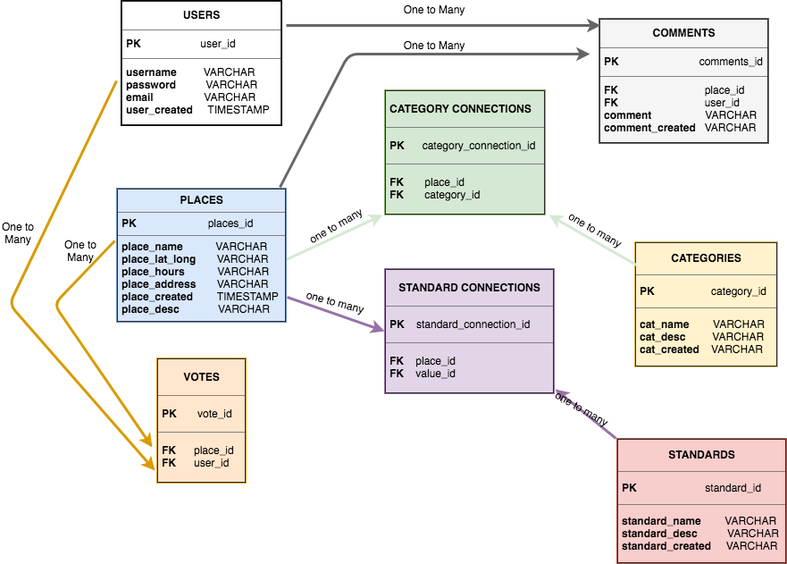

# upShop ⬆️ [UpShop App](https://upshop.herokuapp.com/)

_Add value to your next purchase_

_Make every purchase count_

## To run the app
The app has been built for smart phones.
You can view the app by right clicking on the page and selecting 'Inspect'.
Then toggle the device toolbar to a phone device.

## MVP
An app that allows the user to search for businesses that reflect their values as well as contribute to the upShop community by adding/editing businesses.

### App features:
- Users to search for category or by business name
- Options populate the map
- Business page for each business featured
- Business will populate the page according to users' current location or user input post code
- Users able to add/edit businesses
- Users able to upvote businesses
- Users able to add comments to businesses

### User Stories
As a user I want to...
- Find places nearby that meet certain criteria
- Be able to search for places by category
- Be able to see a list of businesses in my area/area selected
- Be able to identify what values the business adheres to
- Be able to understand what each ethical value means
- Be able to submit a business
- Be able to vote on businesses
- Be able to comment on businesses
- Be able to edit businesses
- Navigate easily between different features on the app
- Click on a business and have it open in GoogleMaps/Apple Map so I can go to the business

### Tech Stack
Express, Handlebars, Postgres, SASS, Leaflet (built on OpenStreetMap)

### Potential Resources
Data will be provided by users adding and editing businesses to the app.
Businesses may also be verified through the below sources:
- [Good Shopping Guide](http://www.thegoodshoppingguide.com/ethical-energy/)

- [Ethical Consumer](http://www.ethicalconsumer.org/)

- [Living Wage Website](https://www.livingwage.org.uk/accredited-living-wage-employers)
Provides a list of employers that pay the living wage, can sort by category.

### Prototype
Made on Figma and Invision
[Prototype](https://invis.io/P5F7LDVRU)

### Software Architecture
### Schema

